

**ĐẠI HỌC BÁCH KHOA HÀ NỘI**

**TRƯỜNG CÔNG NGHỆ THÔNG TIN VÀ TRUYỀN THÔNG**

**\---------------o0o---------------**

**BÁO CÁO BÀI TẬP LỚN**

**HỌC PHẦN: IT3120 – PHÂN TÍCH VÀ THIẾT KẾ HỆ THỐNG**

**ĐỀ TÀI**

**HỆ THỐNG QUẢN LÝ ĐỊNH DANH XÁC THỰC ĐA YẾU TỐ** 

**Giảng viên hướng dẫn: Nguyễn Kiêm Hiếu**

**Mã lớp học: 168500**

**Nhóm: 28**

**Danh sách thành viên:**

1. Đoàn Đăng Khoa \- 20235353  
2. Nguyễn Hữu Long \- 20235368  
3. Nguyễn Văn Phương 20235403  
4. Vương Toàn Minh Hiếu \- 20235330  
5. Nguyễn Xuân Đức \- 20235046  
   

**Mục lục**

1. Giới thiệu đề tài  
2. Danh sách yêu cầu  
3. Mô hình chức năng  
4. Mô hình hướng cấu trúc

## I. Giới thiệu đề tài

Đề tài tập trung phân tích và thiết kế hệ thống Quản lý Định danh và Truy cập (Identity and Access Management - IAM) có tích hợp xác thực đa yếu tố (Multi-Factor Authentication - MFA) bằng mã TOTP. Hệ thống hướng tới việc cung cấp cơ chế đăng nhập tập trung, quản lý phiên làm việc, kiểm soát tài khoản người dùng và ghi nhận nhật ký bảo mật cho môi trường ứng dụng nội bộ hoặc ứng dụng khách tích hợp qua API.

## II. Danh sách yêu cầu

#### **2.1. Mục tiêu hệ thống (Business Objectives)**

Xây dựng một nền tảng Quản lý Định danh và Truy cập (IAM) tập trung, cung cấp cơ chế xác thực an toàn cho các ứng dụng nội bộ/khách hàng. Hệ thống nhằm giảm thiểu rủi ro bị đánh cắp tài khoản thông qua việc tích hợp Xác thực đa yếu tố (MFA \- TOTP), đồng thời cung cấp công cụ giám sát phiên làm việc thời gian thực cho Quản trị viên.

#### **2.2. Các tác nhân (Actors)**

* **Người dùng cuối (End-User):** Cá nhân sở hữu tài khoản, sử dụng hệ thống để đăng nhập và quản lý bảo mật cá nhân.  
* **Quản trị viên (System Admin):** Người có quyền cao nhất, chịu trách nhiệm quản lý vòng đời tài khoản, cấu hình chính sách bảo mật và giám sát hệ thống.  
* **Ứng dụng Khách (Client Application):** Các hệ thống phần mềm ngoại vi (Web/Mobile) giao tiếp với hệ thống IAM qua API để yêu cầu xác thực danh tính người dùng.
* **Hệ thống gửi thông báo (Email/SMS Agent):** Dịch vụ ngoài nhận yêu cầu từ IAM để gửi email khôi phục mật khẩu, cảnh báo bảo mật hoặc mã xác thực trong các quy trình được hệ thống cho phép.

#### **2.3. Yêu cầu chức năng (Functional Requirements \- FR)**

Được chia thành 4 phân hệ (Module) cốt lõi:

**Phân hệ 1: Quản lý Tài khoản và Phân quyền (Identity & Access)**

* **FR-1.01:** Hệ thống cho phép Quản trị viên tạo mới, cập nhật thông tin và vô hiệu hóa (Deactivate) tài khoản người dùng.  
* **FR-1.02:** Hệ thống cho phép gán/thu hồi vai trò (Role-based Access Control \- RBAC) cho người dùng.  
* **FR-1.03:** Hệ thống cho phép người dùng tự đổi mật khẩu và khôi phục mật khẩu (Quên mật khẩu) qua Email.

**Phân hệ 2: Quản lý Phiên làm việc (Session Management)**

* **FR-2.01:** Hệ thống hỗ trợ đăng nhập bước 1 bằng Username và Mật khẩu.  
* **FR-2.02:** Hệ thống cấp phát Token (JWT) hoặc Session ID có thời hạn sau khi người dùng hoàn tất các bước xác thực bắt buộc (mật khẩu và MFA nếu tài khoản đã bật MFA).  
* **FR-2.03:** Hệ thống hiển thị danh sách các thiết bị/trình duyệt đang đăng nhập của một tài khoản (Thiết bị, IP, Thời gian, Vị trí).  
* **FR-2.04:** Hệ thống cho phép người dùng hoặc Quản trị viên đăng xuất (Revoke) một phiên làm việc từ xa.

**Phân hệ 3: Vòng đời Xác thực Đa yếu tố (MFA Lifecycle) \- *Trọng tâm đồ án***

* **FR-3.01:** Hệ thống cho phép người dùng kích hoạt MFA bằng cách sinh ra một mã QR (chứa Secret Key) để quét bằng ứng dụng Authenticator.  
* **FR-3.02:** Hệ thống yêu cầu xác thực bước 2 bằng mã TOTP 6 số (thay đổi mỗi 30 giây) sau khi nhập đúng mật khẩu.  
* **FR-3.03:** Hệ thống sinh ra bộ "Mã dự phòng" (Recovery Codes) dùng một lần để người dùng tải về khi cấu hình MFA.  
* **FR-3.04:** Hệ thống cho phép xác thực bằng Mã dự phòng trong trường hợp người dùng mất thiết bị Authenticator.  
* **FR-3.05:** Hệ thống cho phép tắt MFA, nhưng bắt buộc phải xác thực lại bằng mật khẩu và mã MFA hiện tại để xác nhận hành động.

**Phân hệ 4: Quản trị An ninh và Nhật ký (Security Audit & Dashboard)**

* **FR-4.01:** Hệ thống tự động ghi lại toàn bộ nhật ký (Audit Log) các hành động nhạy cảm: Đăng nhập thành công/thất bại, Bật/Tắt MFA, Đổi mật khẩu.  
* **FR-4.02:** Hệ thống tự động khóa tài khoản tạm thời (Lockout) nếu phát hiện nhập sai mật khẩu hoặc sai mã MFA quá 5 lần liên tiếp (Chống Brute-force).  
* **FR-4.03:** Hệ thống cung cấp Dashboard thống kê cho Quản trị viên: Tỷ lệ người dùng bật MFA, Số lượng cảnh báo tấn công, Danh sách IP đáng ngờ.

#### **2.4. Yêu cầu phi chức năng (Non-Functional Requirements \- NFR)**

Đây là phần giúp xác định các ràng buộc chất lượng quan trọng của hệ thống:

* **NFR-1 (Bảo mật \- Security):** Mật khẩu không bao giờ được lưu dưới dạng plain-text, phải được băm (Hash) và thêm "muối" (Salt) bằng thuật toán chuẩn công nghiệp (Bcrypt hoặc Argon2).  
  * Các Secret Key của MFA lưu trong CSDL phải được mã hóa đối xứng (AES-256).  
* **NFR-2 (Hiệu năng \- Performance):** Thời gian phản hồi cho một yêu cầu xác thực MFA (từ lúc nhập mã đến lúc trả về kết quả) phải dưới 1 giây để đảm bảo trải nghiệm người dùng.  
* **NFR-3 (Tính đồng bộ \- Synchronization):** Thuật toán tính toán mã TOTP trên Server phải có cơ chế dung sai thời gian (Time Drift Tolerance) khoảng ±30 giây để xử lý trường hợp đồng hồ trên điện thoại của người dùng bị lệch so với máy chủ.  
* **NFR-4 (Giao diện \- Usability):** Giao diện quản trị phải tương thích trên cả nền tảng Web và thiết bị di động (Responsive Design).

#### **2.5. Các quy tắc nghiệp vụ (Business Rules)**

* **BR-01:** Mật khẩu tối thiểu 8 ký tự, bao gồm chữ hoa, chữ thường, số và ký tự đặc biệt.  
* **BR-02:** Mã TOTP chỉ có hiệu lực trong vòng 30 giây kể từ lúc sinh ra. Một mã TOTP chỉ được sử dụng thành công 1 lần duy nhất (chống Replay Attack).  
* **BR-03:** Tài khoản bị khóa tự động (do nhập sai quá số lần) sẽ tự động mở khóa sau 30 phút, hoặc phải được Quản trị viên mở khóa thủ công.

## III. Mô hình chức năng

### 3.1 Các tác nhân

Hệ thống Quản lý Định danh và Truy cập (IAM) được thiết kế theo mô hình B2E (Nội bộ doanh nghiệp), bao gồm 4 tác nhân chính tham gia vào việc tương tác với hệ thống. Các tác nhân này được chia làm hai nhóm: Tác nhân con người (Human Actors) và Tác nhân hệ thống (System/Non-human Actors).

A. Nhóm Tác nhân Con người:

* **Người dùng cuối (End User):**  
  * **Mô tả:** Là các nhân viên trong tổ chức/doanh nghiệp có nhu cầu truy cập vào các ứng dụng nội bộ.  
  * **Vai trò/Quyền hạn:** Người dùng cuối sử dụng hệ thống IAM như một cổng đăng nhập tập trung (SSO). Họ có quyền quản lý thông tin định danh cá nhân, thay đổi mật khẩu, quản lý các phiên đăng nhập (chủ động đăng xuất khỏi các thiết bị) và đặc biệt là tự thiết lập/cấu hình vòng đời bảo mật đa yếu tố (Bật/Tắt MFA, tạo mã dự phòng).  
* **Quản trị viên hệ thống (System Admin):**  
  * **Mô tả:** Là những nhân sự thuộc bộ phận IT/Bảo mật có đặc quyền cao nhất trong hệ thống IAM. Trong biểu đồ Use Case, tác nhân này có mối quan hệ Kế thừa (Generalization) từ End User, nghĩa là Admin cũng mang đầy đủ mọi quyền hạn của một User thông thường.  
  * **Vai trò/Quyền hạn:** Admin chịu trách nhiệm quản lý vòng đời tài khoản của toàn bộ nhân viên (Tạo mới, Cấp quyền, Khóa/Mở khóa tài khoản khi có sự cố hoặc khi nhân viên nghỉ việc). Ngoài ra, Admin đóng vai trò giám sát an ninh thông qua việc xem xét nhật ký hệ thống (Audit Logs) để phát hiện các truy cập bất thường.

B. Nhóm Tác nhân Hệ thống:

* Ứng dụng Khách / Hệ thống tích hợp (`<<System>>` Client Application):  
  * **Mô tả:** Là các phần mềm nghiệp vụ bên thứ ba trong hệ sinh thái của doanh nghiệp (Ví dụ: App Nhân sự, App Kế toán...).  
  * **Vai trò/Quyền hạn:** Tác nhân này hoàn toàn không có giao diện đăng nhập riêng và không lưu trữ mật khẩu của người dùng. Thay vào đó, nó giao tiếp với hệ thống IAM thông qua các API Backend. Vai trò chính của tác nhân này là nhận Token (JWT) từ người dùng, sau đó gọi API sang hệ thống IAM để yêu cầu xác minh tính hợp lệ của Token và lấy thông tin định danh (User Profile) để cấp quyền truy cập vào app.  
* Hệ thống gửi tin nhắn (`<<System>>` Email/SMS Agents):  
  * **Mô tả:** Là các dịch vụ kết nối bên ngoài (External Services) như máy chủ SMTP (để gửi Email) hoặc các nhà cung cấp dịch vụ viễn thông (để gửi SMS).  
  * **Vai trò/Quyền hạn:** Đây là tác nhân bị động, nhận lệnh từ hệ thống IAM để thực hiện việc gửi các đường link khôi phục mật khẩu (Recovery Link) hoặc gửi mã xác thực dùng một lần (OTP) đến thiết bị cá nhân của người dùng trong quá trình xác thực hoặc cấp lại thông tin.

### 3.2 Biểu đồ ca sử dụng tổng quan

Biểu đồ ca sử dụng tổng quan thể hiện các nhóm chức năng chính và mối quan hệ giữa tác nhân với hệ thống IAM:

Nguồn PlantUML: [ca_tongquan.puml](../ca_tongquan.puml)

```plantuml
!include ../ca_tongquan.puml
```

### 3.3 Biểu đồ ca sử dụng phân rã

#### 3.3.1 Phân rã ca sử dụng Authentication & Session Management

Nhóm ca sử dụng này bao gồm các chức năng đăng nhập, đăng xuất, đổi/khôi phục mật khẩu và quản lý phiên làm việc. Ca sử dụng `Đăng nhập` bao gồm kiểm tra tài khoản, kiểm tra trạng thái khóa, xác định trạng thái MFA và chỉ cấp phiên chính thức sau khi toàn bộ bước xác thực bắt buộc hoàn tất.

Nguồn PlantUML: [ca_Authentication_Session_Management.puml](../ca_Authentication_Session_Management.puml)

```plantuml
!include ../ca_Authentication_Session_Management.puml
```

#### 3.3.2 Phân rã ca sử dụng MFA Lifecycle 

Nhóm MFA Lifecycle bao gồm quy trình bật/tắt MFA, sinh QR và Secret Key, sinh mã khôi phục, xác thực TOTP và xác thực bằng mã khôi phục. Các use case kỹ thuật như tạo QR, tạo recovery code và xác thực TOTP được gọi bởi các use case nghiệp vụ lớn hơn.

Nguồn PlantUML: [ca_MFALifecycle.puml](../ca_MFALifecycle.puml)

```plantuml
!include ../ca_MFALifecycle.puml
```

#### 3.3.3. Phân rã ca sử dụng System Administration 

Nhóm System Administration bao gồm quản lý người dùng, khóa/mở khóa tài khoản, phân quyền, giám sát hệ thống và truy xuất nhật ký kiểm soát. Các thao tác quản trị nhạy cảm đều phải ghi audit log.

Nguồn PlantUML: [ca_SystemAdministration.puml](../ca_SystemAdministration.puml)

```plantuml
!include ../ca_SystemAdministration.puml
```

#### 3.3.4 Phân rã ca sử dụng API Communication 

Nhóm API Communication mô tả cách ứng dụng khách tích hợp với IAM. Ứng dụng khách gửi token đến API Gateway; Gateway xác thực chữ ký, hạn dùng và trạng thái MFA trước khi trả dữ liệu người dùng hoặc từ chối truy cập.

Nguồn PlantUML: [ca_APICommunication.puml](../ca_APICommunication.puml)

```plantuml
!include ../ca_APICommunication.puml
```

### 3.4 Đặc tả các ca sử dụng

#### 3.4.1 Authentication & Session Management 

Đặc tả ca sử dụng UC-AUTH-01: Đăng nhập hệ thống (Login) 

| Trường | Nội dung |
| :---: | ----- |
| **Use Case ID** | UC-AUTH-01 |
| **Tên Use Case** | Đăng nhập hệ thống  |
| **Tác nhân** | Người dùng, Quản trị viên |
| **Mô tả** | Hỗ trợ người dùng đăng nhập bằng Username và Mật khẩu  |
| **Điều kiện** | Tài khoản đang hoạt động, không bị khóa  |
| **Yêu cầu** | Người dùng cung cấp thông tin hợp lệ  |
| **Luồng sự kiện chính** | 1\. Nhập Username \+ Password. 2\. Hệ thống kiểm tra thông tin tài khoản và trạng thái khóa. 3\. Hệ thống kiểm tra cấu hình MFA. 4\. Nếu tài khoản đã bật MFA, hệ thống tạo phiên xác thực tạm thời và gọi UC-MFA-05 để xác thực bước 2\. 5\. Khi toàn bộ bước xác thực bắt buộc thành công, hệ thống cấp JWT/Session chính thức và chuyển hướng Dashboard. |
| **Luồng sự kiện phụ** | Sai mật khẩu: Báo lỗi, đếm số lần thất bại. Quá 5 lần sai liên tiếp: Khóa tài khoản 30 phút. Có MFA nhưng xác thực bước 2 thất bại: Không cấp JWT/Session chính thức và yêu cầu thử lại theo chính sách giới hạn số lần. |

Đặc tả ca sử dụng UC-AUTH-02: Khôi phục mật khẩu (Recovery Password)

| Trường | Nội dung |
| :---: | ----- |
| **Use Case ID** | UC-AUTH-02 |
| **Tên Use Case** | Khôi phục mật khẩu  |
| **Tác nhân** | Người dùng, Email Agent  |
| **Mô tả** | Lấy lại mật khẩu |
| **Điều kiện** | Người dùng quên mật khẩu  |
| **Yêu cầu** | Chọn “Quên mật khẩu”  |
| **Luồng sự kiện chính** | 1\. Nhập Email 2\. Kiểm tra lại Email 3\. Gửi OTP/Link   4\. Nhận Email 5\. Nhập OTP/ click link  6\. Đặt mật khẩu mới 7\. Thông báo thành công |
| **Luồng sự kiện phụ** | Email không tồn tại : Thông báo chung  OTP hết hạn : Yêu cầu gửi lại  |

   
Đặc tả ca sử dụng UC-AUTH-03: Đổi mật khẩu (Change Password) 

| Trường | Nội dung |
| :---: | ----- |
| **Use Case ID** | UC-AUTH-03 |
| **Tên Use Case** | Đổi mật khẩu |
| **Tác nhân** | Người dùng, Quản trị viên |
| **Mô tả** | Thay đổi mật khẩu cá nhân |
| **Điều kiện** | Đã đăng nhập  |
| **Yêu cầu** | Muốn đổi mật khẩu |
| **Luồng sự kiện chính** | 1\. Chọn đổi mật khẩu 2\. Nhập mật khẩu hiện tại \+ mới 3\. Xác nhận mật khẩu hiện tại 4\. Kiểm tra rule mật khẩu 5\. Hash pass 6\. Lưu DB \+ log |
| **Luồng sự kiện phụ** | Sai mật khẩu hiện tại: Từ chối. Mật khẩu yếu: Yêu cầu nhập lại. |

Đặc tả ca sử dụng UC-AUTH-04: Quản lý phiên làm việc (Manage Session) 

| Trường | Nội dung |
| :---: | ----- |
| **Use Case ID** | UC-AUTH-04 |
| **Tên Use Case** | Quản lý phiên  |
| **Tác nhân** | Người dùng, Quản trị viên |
| **Mô tả** | Xem và thu hồi session  |
| **Điều kiện** | Đã đăng nhập  |
| **Yêu cầu** | Kiểm tra thiết bị  |
| **Luồng sự kiện chính** | 1\. Mở quản lý phiên  2\. Lấy lịch sử đăng nhập  3\. Hiển thị device, IP, thời gian 4\. Xem thông tin |
| **Luồng sự kiện phụ** | Thu hồi session: Hủy token, bắt đăng nhập lại.  |

Đặc tả ca sử dụng UC-AUTH-05: Đăng xuất (Logout) 

| Trường | Nội dung |
| :---: | ----- |
| **Use Case ID** | UC-AUTH-05 |
| **Tên Use Case** | Đăng xuất |
| **Tác nhân** | Người dùng, Quản trị viên |
| **Mô tả** | Kết thúc phiên làm việc |
| **Điều kiện** | Đã đăng nhập  |
| **Yêu cầu** | Muốn đăng xuất |
| **Luồng sự kiện chính** | 1\. Nhấn “Đăng xuất”  2\. Xóa token/session  3\. Chuyển về trang login |

#### 3.4.2 MFA Lifecycle

Đặc tả ca sử dụng UC-MFA-01: Bật xác thực đa yếu tố \- Enable MFA

| Trường | Nội dung |
| :---: | ----- |
| **Use Case ID** | UC-MFA-01 |
| **Tên Use Case** | Bật xác thực đa yếu tố |
| **Tác nhân** | Người dùng, Quản trị viên |
| **Mô tả** | Cho phép người dùng thiết lập và kích hoạt lớp bảo mật thứ 2 thông qua ứng dụng Authenticator |
| **Điều kiện** | Hệ thống đang hoạt động và người dùng đã đăng nhập vào hệ thống. Tài khoản của người dùng chưa được bật xác thực đa yếu tố |
| **Yêu cầu** | Người dùng có nhu cầu tăng cường bảo mật và chủ động chọn chức năng “Bật xác thực đa yếu tố”. Người dùng có sẵn thiết bị di động để cài đặt ứng dụng quét mã |
| **Luồng sự kiện chính** | 1\. Người dùng yêu cầu bật MFA trên giao diện cài đặt. 2\. Hệ thống gọi ca sử dụng "Tạo mã QR và Khóa bí mật". 3\. Hệ thống hiển thị QR Code và chuỗi khóa bí mật (Secret Key) lên màn hình. 4\. Người dùng sử dụng ứng dụng Authenticator quét mã và nhập mã TOTP (6 số) vào hệ thống. 5\. Hệ thống kiểm tra tính hợp lệ của mã. 6\. Hệ thống gọi ca sử dụng "Tạo mã khôi phục". 7\. Hệ thống hiển thị danh sách mã khôi phục, yêu cầu người dùng lưu lại. 8\. Người dùng xác nhận "Tôi đã lưu mã an toàn". 9\. Hệ thống cập nhật trạng thái MFA thành "Đã kích hoạt" và thông báo thành công. |
| **Luồng sự kiện phụ** | 4.1. Người dùng chưa cài đặt ứng dụng Authenticator: Hệ thống hiển thị liên kết/hướng dẫn tải ứng dụng và chờ người dùng thao tác. 5.1. Mã TOTP nhập vào sai hoặc đã hết thời gian hiệu lực (thường là 30 giây): Hệ thống báo lỗi và yêu cầu người dùng nhập lại mã mới nhất vừa xuất hiện trên ứng dụng. |

Đặc tả ca sử dụng UC-MFA-02: Tắt xác thực đa yếu tố \- Disable MFA

| Trường | Nội dung |
| :---: | ----- |
| **Use Case ID** | UC-MFA-02 |
| **Tên Use Case** | Tắt xác thực đa yếu tố |
| **Tác nhân** | Người dùng, Quản trị viên |
| **Mô tả** | Cho phép người dùng gỡ bỏ lớp bảo mật thứ 2 khỏi tài khoản để quay về phương thức xác thực truyền thống |
| **Điều kiện** | Người dùng đã đăng nhập thành công vào hệ thống. Tài khoản hiện đang ở trạng thái "Đã kích hoạt MFA". |
| **Yêu cầu** | Người dùng có nhu cầu thay đổi thiết bị xác thực hoặc giảm bớt bước đăng nhập. Người dùng phải có quyền truy cập vào phương thức xác thực lớp 2\. |
| **Luồng sự kiện chính** | 1\. Người dùng chọn chức năng "Tắt MFA" trong menu Cài đặt bảo mật. 2\. Hệ thống yêu cầu người dùng nhập lại mật khẩu hiện tại để xác thực lại phiên nhạy cảm. 3\. Hệ thống yêu cầu xác thực danh tính lớp thứ hai bằng cách gọi ca sử dụng "Xác thực đa yếu tố" (UC-MFA-05). 4\. Người dùng chọn phương thức xác thực và cung cấp mã hợp lệ. 5\. Hệ thống xác nhận mật khẩu và mã MFA đều chính xác. 6\. Hệ thống tiến hành xóa bỏ Khóa bí mật (Secret Key) và tất cả mã khôi phục dự phòng liên quan đến tài khoản. 7\. Hệ thống cập nhật trạng thái MFA thành "Chưa kích hoạt" và gửi thông báo xác nhận cho người dùng. |
| **Luồng sự kiện phụ** | 2.1. Người dùng nhập sai mật khẩu hiện tại: Hệ thống từ chối thao tác tắt MFA. 3.1. Người dùng mất thiết bị và không có mã khôi phục: Luồng này kết thúc, người dùng phải liên hệ Quản trị viên hệ thống để yêu cầu hỗ trợ gỡ bỏ MFA thủ công. 5.1. Xác thực thất bại: Hệ thống hiển thị thông báo lỗi và từ chối thực hiện lệnh tắt MFA để bảo vệ tài khoản. |

Đặc tả ca sử dụng UC-MFA-03: Tạo mã QR và khoá bí mật – Generate QR & Secret Key

| Trường | Nội dung |
| :---: | ----- |
| **Use Case ID** | UC-MFA-03 |
| **Tên Use Case** | Tạo mã QR và khoá bí mật |
| **Tác nhân** | Hệ thống |
| **Mô tả** | Sinh ra một chuỗi khoá bí mật duy nhất, định dạng thành chuẩn liên kết nhận diện và đóng gói thành hình ảnh mã QR Code |
| **Điều kiện** | Hệ thống đang xử lý yêu cầu bật MFA (UC-MFA-01) của người dùng. |
| **Yêu cầu** | Module "Bật xác thực đa yếu tố" gửi yêu cầu khởi tạo mã bảo mật cho một tài khoản cụ thể. |
| **Luồng sự kiện chính** | 1\. Hệ thống dùng CSPRNG sinh Secret Key 160-bit, mã hóa Base32 và lưu tạm với trạng thái `mfa_pending`. 2\. Hệ thống tạo OTP Auth URI theo cấu trúc `otpauth://totp/[Tên App]:[Email]?secret=[Base32_Key]&issuer=[Tên App]`. 3\. Hệ thống chuyển URI thành QR Code. 4\. Giao diện hiển thị QR và Secret Key dạng văn bản. 5\. Người dùng quét QR bằng Authenticator và nhập mã OTP 6 số đầu tiên. 6\. Nếu mã hợp lệ, hệ thống cập nhật `is_mfa_enabled = true`; mã khôi phục được tạo bởi UC-MFA-04 trong quy trình UC-MFA-01. |
| **Luồng sự kiện phụ** | 5.1. Mã OTP sai hoặc hết hạn: Hệ thống báo lỗi, đếm số lần nhập sai và hủy thiết lập nếu vượt quá giới hạn. 5.2. Người dùng hủy thao tác hoặc đóng trình duyệt trước khi xác minh: Hệ thống dọn dẹp Secret Key đang ở trạng thái `mfa_pending` khi phát hiện quy trình chưa hoàn tất. 5.3. Phiên làm việc hết hạn: Hệ thống từ chối tiếp nhận mã OTP, hủy thiết lập tạm thời và yêu cầu người dùng đăng nhập lại. |

Đặc tả ca sử dụng UC-MFA-04: Tạo mã khôi phục – Generate Recovery Codes

| Trường | Nội dung |
| :---: | ----- |
| **Use Case ID** | UC-MFA-04 |
| **Tên Use Case** | Tạo mã khôi phục |
| **Tác nhân** | Hệ thống |
| **Mô tả** | Sinh ra một bộ mã dự phòng tĩnh, dùng một lần để người dùng có thể truy cập tài khoản khi không có thiết bị nhận mã TOTP. |
| **Điều kiện** | Hệ thống đang xử lý bước cuối cùng của quy trình Bật MFA (UC-MFA-01) hoặc khi người dùng yêu cầu cấp lại bộ mã mới. |
| **Yêu cầu** | Module bảo mật yêu cầu khởi tạo dữ liệu dự phòng cho một người dùng cụ thể. |
| **Luồng sự kiện chính** | 1\. Hệ thống sử dụng thuật toán sinh số ngẫu nhiên để tạo ra một danh sách gồm 10 mã (mỗi mã 8-10 ký tự). 2\. Hệ thống thực hiện băm (hash) các mã này bằng thuật toán an toàn. 3\. Hệ thống lưu trữ các bản băm vào cơ sở dữ liệu gắn với ID người dùng. 4\. Hệ thống trả về danh sách mã dưới dạng văn bản chưa mã hóa về cho tiến trình gọi nó để hiển thị cho người dùng. |
| **Luồng sự kiện phụ** | 3.1. Lỗi kết nối cơ sở dữ liệu: Hệ thống thông báo không thể lưu mã khôi phục và yêu cầu người dùng thử lại quy trình kích hoạt MFA từ đầu. |

Đặc tả ca sử dụng UC-MFA-05: Xác thực đa yếu tố \- Authenticate MFA

| Trường | Nội dung |
| :---: | ----- |
| **Use Case ID** | UC-MFA-05 |
| **Tên Use Case** | Xác thực đa yếu tố |
| **Tác nhân** | Hệ thống |
| **Mô tả** | Đây là ca sử dụng tổng quát (Abstract) đóng vai trò điều phối việc kiểm tra danh tính lớp thứ hai của người dùng. |
| **Điều kiện** | Được gọi bởi các tiến trình yêu cầu bảo mật cao như "Đăng nhập" hoặc "Tắt MFA". |
| **Yêu cầu** | Hệ thống cần xác định người dùng đang thao tác thực sự là chủ sở hữu tài khoản. |
| **Luồng sự kiện chính** | 1\. Hệ thống hiển thị các tùy chọn xác thực có sẵn cho người dùng (Sử dụng App Authenticator hoặc Nhập mã khôi phục). 2\. Người dùng lựa chọn một phương thức cụ thể. 3\. Hệ thống gọi ca sử dụng tương ứng dựa trên lựa chọn của người dùng (UC-MFA-06 hoặc UC-MFA-07). 4\. Hệ thống nhận kết quả xác thực (Hợp lệ/Không hợp lệ) và trả về cho tiến trình đã gọi nó. |
| **Luồng sự kiện phụ** | 2.1. Người dùng không chọn phương thức nào trong thời gian quy định: Hệ thống tự động hủy phiên giao dịch và yêu cầu đăng nhập lại từ đầu. |

Đặc tả ca sử dụng UC-MFA-06: Xác thực bằng mã TOTP – Verify TOTP Code

| Trường | Nội dung |
| :---: | ----- |
| **Use Case ID** | UC-MFA-06 |
| **Tên Use Case** | Xác thực bằng mã TOTP |
| **Tác nhân** | Hệ thống |
| **Mô tả** | Thuật toán tính toán và đối chiếu tính hợp lệ của mã 6 số do người dùng nhập vào dựa trên Secret Key đã lưu trữ. |
| **Điều kiện** | Hệ thống đang ở bước yêu cầu xác thực danh tính MFA (khi Đăng nhập hoặc Tắt MFA) và người dùng chọn phương thức xác thực qua App. |
| **Yêu cầu** | Người dùng cung cấp mã xác thực gồm 6 chữ số lấy từ ứng dụng. |
| **Luồng sự kiện chính** | 1\. Hệ thống tiếp nhận mã số TOTP từ giao diện người dùng gửi lên. 2\. Hệ thống truy vấn cơ sở dữ liệu để lấy Secret Key gốc của tài khoản đang thao tác. 3\. Hệ thống sử dụng thuật toán băm (HMAC-SHA1 hoặc thuật toán cấu hình theo chuẩn TOTP) kết hợp Secret Key và mốc thời gian hiện tại để tự động sinh ra mã OTP nội bộ trong cửa sổ thời gian cho phép. 4\. Hệ thống đối chiếu mã người dùng nhập vào với mã nội bộ vừa sinh ra. 5\. Hệ thống kiểm tra `timeStep` của mã chưa từng được dùng thành công trước đó đối với tài khoản này. 6\. Hệ thống lưu `lastUsedTimeStep` để chống replay và trả kết quả "Hợp lệ" (True) về cho tiến trình gọi nó. |
| **Luồng sự kiện phụ** | 4.1. Hai mã không trùng khớp nhau hoặc mã nhập vào đã quá hạn do độ trễ thời gian: Hệ thống trả kết quả "Không hợp lệ" (False). 5.1. Mã đúng nhưng thuộc `timeStep` đã được dùng thành công trước đó: Hệ thống từ chối xác thực để chống Replay Attack. |

Đặc tả ca sử dụng UC-MFA-07: Xác thực bằng mã khôi phục – Verify Recovery Code

| Trường | Nội dung |
| :---: | ----- |
| **Use Case ID** | UC-MFA-07 |
| **Tên Use Case** | Xác thực bằng mã khôi phục |
| **Tác nhân** | Hệ thống |
| **Mô tả** | Kiểm tra tính hợp lệ của mã dự phòng và đảm bảo mỗi mã chỉ được sử dụng duy nhất một lần. |
| **Điều kiện** | Người dùng đã chọn phương thức "Sử dụng mã khôi phục" trong luồng xác thực (UC-MFA-05). |
| **Yêu cầu** | Người dùng cung cấp một mã khôi phục đã được cấp trước đó. |
| **Luồng sự kiện chính** | 1\. Hệ thống tiếp nhận mã khôi phục từ người dùng. 2\. Hệ thống truy vấn danh sách mã dự phòng (đã băm) của người dùng trong cơ sở dữ liệu. 3\. Hệ thống so khớp mã nhập vào với danh sách hiện có. 4\. Nếu tìm thấy mã trùng khớp, hệ thống đánh dấu mã đó là "Đã sử dụng" hoặc xóa vĩnh viễn khỏi danh sách. 5\. Hệ thống trả về kết quả "Hợp lệ" cho tiến trình gọi. |
| **Luồng sự kiện phụ** | 3.1. Mã nhập vào không tồn tại hoặc đã được sử dụng trước đó: Hệ thống trả về kết quả "Không hợp lệ". 4.1. Mã khôi phục cuối cùng đã được sử dụng: Hệ thống cảnh báo người dùng cần tạo bộ mã mới sau khi truy cập được tài khoản. |

#### 3.4.3 System Administration

Đặc tả ca sử dụng UC-SYS-01 Quản lý người dùng hệ thống

| Tên ca sử dụng: Quản lý người dùng hệ thống |  | ID: UC-SYS-01 | Mức quan trọng: Cao |
| :---- | :---- | :---- | :---- |
| **Tác nhân chính:** Admin (quản trị viên) | **Loại ca sử dụng:** Chi tiết, thiết yếu |  |  |
| **Các bên liên quan và mối quan tâm:** Admin (quản lý tài khoản), Người dùng hệ thống (đối tượng được quản lý). |  |  |  |
| **Mô tả ngắn gọn:** Cho phép Admin thực hiện các thao tác thêm mới, cập nhật thông tin hoặc khóa tài khoản của các quản trị viên/nhân viên vận hành trong hệ thống. |  |  |  |
| **Kích hoạt:** Admin chọn chức năng "Quản lý người dùng" trên giao diện Admin Dashboard.             	Loại: Ngoại (External)   |  |  |  |
| **Các mối liên hệ:**             	Tương tác: Không             	Bao gồm: Không             	Mở rộng: Khóa/Mở khóa tài khoản (UC-SYS-02).             	Khái quát hóa: Không |  |  |  |
| **Luồng sự kiện thông thường:** 1\. 	Admin yêu cầu xem danh sách người dùng. 2\. 	Hệ thống hiển thị danh sách người dùng hiện tại. 3\. 	Admin chọn thao tác (Thêm/Sửa/Xóa). 4\. 	Admin nhập/chỉnh sửa thông tin người dùng. 5\. 	Hệ thống kiểm tra tính hợp lệ của dữ liệu. 6\. 	Hệ thống cập nhật cơ sở dữ liệu và thông báo thành công.   |  |  |  |
| **Các luồng con:**   	S-1: Tìm kiếm người dùng theo tên hoặc mã nhân viên. |  |  |  |
| **Các luồng ngoại lệ/tương đương:** Dữ liệu nhập vào không hợp lệ (Trùng tên đăng nhập, định dạng email sai) \-\> Hệ thống yêu cầu nhập lại. |  |  |  |
|  |  |  |  |

 

Đặc tả ca sử dụng UC-SYS-02 Khóa/Mở khóa tài khoản

| Tên ca sử dụng: Khóa/Mở khóa tài khoản |  | ID: UC-SYS-02 | Mức quan trọng: Cao |
| :---- | :---- | :---- | :---- |
| **Tác nhân chính:** Admin (quản trị viên) | **Loại ca sử dụng:** Chi tiết, thiết yếu |  |  |
| **Các bên liên quan và mối quan tâm:** Người dùng bị khóa (mất quyền truy cập), Bộ phận bảo mật.  |  |  |  |
| **Mô tả ngắn gọn:** Cho phép Admin đình chỉ quyền truy cập của một tài khoản ngay lập tức hoặc khôi phục lại quyền truy cập sau khi đã xác minh an toàn.  |  |  |  |
| **Kích hoạt:** Admin chọn một tài khoản cụ thể trong danh sách người dùng và chọn lệnh "Khóa" hoặc "Mở khóa".              	Loại: Ngoại (External)   |  |  |  |
| **Các mối liên hệ:**             	Tương tác: Không             	Bao gồm: Không             	Mở rộng từ: Quản lý người dùng hệ thống (UC-SYS-01).              	Khái quát hóa: Không |  |  |  |
| **Luồng sự kiện thông thường:** 1\. Admin tìm kiếm tài khoản cần xử lý trong danh sách. 2\. Hệ thống hiển thị trạng thái hiện tại (Đang hoạt động/Đang khóa). 3\. Admin chọn lệnh thay đổi trạng thái. 4\. Admin nhập lý do thay đổi (ví dụ: Nghi vấn bị hack, nhân viên nghỉ việc). 5\. Hệ thống cập nhật trạng thái và vô hiệu hóa mọi session hiện tại của tài khoản đó. |  |  |  |
| **Các luồng con:**   	S-1: Gửi email thông báo tự động cho người dùng về việc thay đổi trạng thái tài khoản.  |  |  |  |
| **Các luồng ngoại lệ/tương đương:** Admin cố gắng khóa tài khoản "Super Admin" duy nhất còn lại \-\> Hệ thống ngăn chặn và thông báo lỗi để tránh mất quyền quản trị toàn cục.  |  |  |  |
|  |  |  |  |

 

Đặc tả ca sử dụng UC-SYS-03 Phân quyền người dùng

| Tên ca sử dụng: Phân quyền người dùng |  | ID: UC-SYS-03 | Mức quan trọng: Trung bình đến Cao |
| :---- | :---- | :---- | :---- |
| **Tác nhân chính:** Admin (quản trị viên) | **Loại ca sử dụng:** Chi tiết, thiết yếu  |  |  |
| **Các bên liên quan và mối quan tâm:** Bộ phận bảo mật, Admin. |  |  |  |
| **Mô tả ngắn gọn:** Thiết lập các vai trò (Roles) và gán các quyền hạn tương ứng (Permissions) cho từng vai trò đó. |  |  |  |
| **Kích hoạt:** Admin truy cập vào menu "Quản lý vai trò và phân quyền".             	Loại: Ngoại |  |  |  |
| **Các mối liên hệ:**             	Tương tác: Tương tác trực tiếp với cơ sở dữ liệu phân quyền (RBAC).             	Bao gồm: Không             	Mở rộng: Không             	Khái quát hóa: Không |  |  |  |
| **Luồng sự kiện thông thường:** 1\. 	Admin chọn danh sách vai trò. 2\. 	Hệ thống hiển thị các vai trò hiện có. 3\. 	Admin chọn một vai trò để chỉnh sửa hoặc tạo vai trò mới. 4\. 	Admin đánh dấu chọn các quyền hạn (đọc, ghi, xóa...) cho vai trò đó. 5\. 	 Hệ thống lưu cấu hình phân quyền mới. |  |  |  |
| **Các luồng con:**   	S-1: Gán nhanh một tập hợp quyền mẫu cho một vai trò mới. |  |  |  |
| **Các luồng ngoại lệ/tương đương:** Vai trò đang được sử dụng bởi nhiều người dùng không thể xóa ngay lập tức \-\> Hệ thống cảnh báo. |  |  |  |
|  |  |  |  |

 

Đặc tả ca sử dụng UC-SYS-04 Giám sát hoạt động hệ thống

| Tên ca sử dụng: Giám sát hoạt động hệ thống |  | ID: UC-SYS-04 | Mức quan trọng: Trung bình |
| :---- | :---- | :---- | :---- |
| **Tác nhân chính:** Admin (quản trị viên) | **Loại ca sử dụng:** Chi tiết, thiết yếu  |  |  |
| **Các bên liên quan và mối quan tâm:** Admin (quản lý tài khoản), Đội ngũ kỹ thuật (SRE/DevOps). |  |  |  |
| **Mô tả ngắn gọn:** Cung cấp cái nhìn tổng quan về trạng thái sức khỏe của hệ thống IAM/MFA bao gồm tài nguyên CPU, RAM và các session đang hoạt động. |  |  |  |
| **Kích hoạt:** Admin chọn mục "Giám sát hệ thống" (Monitoring).             	Loại: Ngoại (External)   |  |  |  |
| **Các mối liên hệ:**             	Tương tác: Không             	Bao gồm: Truy xuất nhật ký kiểm soát (UC-SYS-05).             	Mở rộng: Không             	Khái quát hóa: Không |  |  |  |
| **Luồng sự kiện thông thường:** 1\. 	Hệ thống thu thập dữ liệu vận hành thời gian thực. 2\. 	Admin xem các biểu đồ thống kê trạng thái. 3\. 	Admin yêu cầu xem chi tiết nhật ký hệ thống để kiểm tra sâu hơn. 4\. 	 Hệ thống gọi UC "Truy xuất nhật ký kiểm soát".   |  |  |  |
| **Các luồng con:**   	S-1: Xuất báo cáo trạng thái hệ thống ra file PDF/Excel. |  |  |  |
| **Các luồng ngoại lệ/tương đương:** Mất kết nối với dịch vụ log hoặc agent giám sát \-\> Hệ thống hiển thị thông báo lỗi kết nối. |  |  |  |

Đặc tả ca sử dụng UC-SYS-05 Truy xuất nhật ký kiểm soát

| Tên ca sử dụng: Truy xuất nhật ký kiểm soát (View Audit Logs)  |  | ID: UC-SYS-05 | Mức quan trọng: Cao |
| :---- | :---- | :---- | :---- |
| **Tác nhân chính:** Admin (quản trị viên) | **Loại ca sử dụng:** Thành phần  |  |  |
| **Các bên liên quan và mối quan tâm:** Cơ quan kiểm toán, Bộ phận điều tra sự cố.  |  |  |  |
| **Mô tả ngắn gọn:** Cho phép Admin xem, tìm kiếm và lọc các bản ghi về mọi hành động nhạy cảm đã xảy ra trên hệ thống (ai đã làm gì, lúc nào, từ IP nào).  |  |  |  |
| **Kích hoạt:** Admin chọn chức năng "Xem nhật ký kiểm soát" hoặc được chuyển hướng từ chức năng Giám sát.             	Loại: Ngoại (External)   |  |  |  |
| **Các mối liên hệ:**             	Tương tác: Không             	Bao gồm trong: Giám sát hoạt động hệ thống (UC-SYS-04).             	Mở rộng: Không             	Khái quát hóa: Không |  |  |  |
| **Luồng sự kiện thông thường:** 1\. Admin chọn khoảng thời gian cần kiểm tra. 2\. Admin thiết lập các bộ lọc (Loại hành động, Tên người thực hiện, Mức độ nghiêm trọng). 3\. Hệ thống truy vấn cơ sở dữ liệu nhật ký. 4\. Hệ thống hiển thị danh sách các bản ghi Audit Log theo thứ tự thời gian.   |  |  |  |
| **Các luồng con:**   	S-1: Xem chi tiết một bản ghi (thông tin kỹ thuật, dữ liệu cũ và dữ liệu mới sau khi thay đổi). |  |  |  |
| **Các luồng ngoại lệ/tương đương:** Dữ liệu nhật ký quá lớn gây chậm hệ thống \-\> Hệ thống yêu cầu giới hạn khoảng thời gian tìm kiếm ngắn hơn. |  |  |  |

#### 3.4.4. API Communication

| Tên ca sử dụng: Xác thực Token |  | ID: UC-API-01 | Mức quan trọng: Cao |
| :---- | :---- | :---- | :---- |
| **Tác nhân chính:** API Gateway | **Loại ca sử dụng:** Cơ bản |  |  |
| **Các bên liên quan và mối quan tâm:** API Gateway (cần biết token có hợp lệ không để cho đi tiếp), Token/Auth Service (thực hiện kiểm tra chữ ký và hạn dùng), MFA Service (kiểm tra trạng thái MFA khi tài nguyên yêu cầu). |  |  |  |
| **Mô tả ngắn gọn:** Hệ thống kiểm tra tính hợp lệ của Access Token (JWT) bao gồm chữ ký số, hạn sử dụng và trạng thái xác thực đa yếu tố (MFA) trước khi cho phép truy cập vào các tài nguyên được bảo vệ. |  |  |  |
| **Kích hoạt:** Bất cứ khi nào có một HTTP Request mang theo Token gọi vào các API yêu cầu bảo mật của hệ thống. Loại: Nội (Internal)  |  |  |  |
| **Các mối liên hệ:**             	Tương tác: API Gateway, Token/Auth Service, MFA Service             	Bao gồm: Không             	Mở rộng: Không             	Khái quát hóa: Không |  |  |  |
| **Luồng sự kiện thông thường:** 1\. API Gateway tiếp nhận Token từ Header của Request. 2\. Token/Auth Service giải mã và xác minh chữ ký số (Signature). 3\. Token/Auth Service kiểm tra thời hạn sống của Token (Expiration time). 4\. API Gateway kiểm tra quyền truy cập và yêu cầu MFA của tài nguyên. 5\. Nếu tài nguyên yêu cầu MFA, hệ thống kiểm tra cờ xác thực đa yếu tố (`mfa_verified` claim) trong nội dung Token. 6\. Hệ thống xác nhận Token hợp lệ, trích xuất UserID và trả kết quả thành công về cho API Gateway. |  |  |  |
| **Các luồng con:**   	S-1: Lưu log quá trình giải mã Token. |  |  |  |
| **Các luồng ngoại lệ/tương đương:**  \- Token không đúng định dạng, sai chữ ký, hoặc đã hết hạn: Trả về trạng thái lỗi `401 Unauthorized`.  \- Token hợp lệ nhưng tài khoản chưa hoàn thành bước xác thực MFA (trong khi tài nguyên yêu cầu): Trả về trạng thái lỗi `403 Forbidden`. |  |  |  |

| Tên ca sử dụng: Lấy thông tin người dùng |  | ID: UC-API-02 | Mức quan trọng: Cao |
| :---- | :---- | :---- | :---- |
| **Tác nhân chính:** Ứng dụng Khách (Client Application) | **Loại ca sử dụng:** Cơ bản |  |  |
| **Các bên liên quan và mối quan tâm:** Ứng dụng Khách (cần dữ liệu để hiển thị giao diện), Người dùng cuối (muốn xem thông tin cá nhân của mình). |  |  |  |
| **Mô tả ngắn gọn:** Ứng dụng Khách gọi API để lấy thông tin hồ sơ cá nhân của người dùng. Hệ thống sẽ xác thực người dùng trước khi truy vấn và trả về dữ liệu. |  |  |  |
| **Kích hoạt:** Người dùng truy cập vào trang thông tin cá nhân trên Ứng dụng Khách, ứng dụng kích hoạt gửi API Request tới hệ thống. Loại: Ngoại (External) |  |  |  |
| **Các mối liên hệ:**             	Tương tác: Ứng dụng Khách, Database             	Bao gồm: Không             	Mở rộng: Không             	Khái quát hóa: Không |  |  |  |
| **Luồng sự kiện thông thường:** 1\. 	Ứng dụng Khách gửi HTTP Request đính kèm Access Token 2\. 	Hệ thống thực thi ca sử dụng **Xác thực Token (UC-API-01)** 3\. 	Xác thực thành công, hệ thống nhận được `UserID` từ luồng xác thực 4\. 	Hệ thống (UserController) sử dụng `UserID` để truy vấn Database 5\. 	Hệ thống tìm thấy thông tin và đóng gói thành định dạng JSON 6\. 	Hệ thống trả về dữ liệu cho Ứng dụng Khách với mã trạng thái `HTTP 200 OK`   |  |  |  |
| **Các luồng con:**   	S-1: Cập nhật thời gian truy cập (Last active time) của người dùng vào Database. |  |  |  |
| **Các luồng ngoại lệ/tương đương:**  \- Quá trình `Xác thực Token` thất bại: Ca sử dụng kết thúc sớm, trả về lỗi 401 hoặc 403 tùy theo kết quả xác thực.  \- Quá trình truy vấn Database không tìm thấy `UserID` (dữ liệu đã bị xóa): Trả về trạng thái `HTTP 404 Not Found`. |  |  |  |

### 3.5 Sơ đồ nghiệp vụ

3.5.1 **Authentication & Session Management (uml)**  
Activity Diagram — Đăng nhập

Nguồn PlantUML: [activity_auth_login.puml](activity_auth_login.puml)

```plantuml
!include activity_auth_login.puml
```


Activity Diagram — Khôi phục mật khẩu  

Nguồn PlantUML: [activity_auth_recovery_password.puml](activity_auth_recovery_password.puml)

```plantuml
!include activity_auth_recovery_password.puml
```

Activity Diagram — Đổi mật khẩu

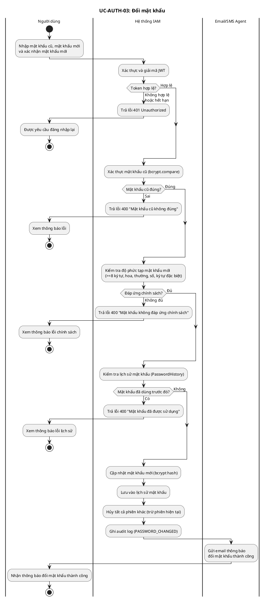


Activity Diagram — Quản lý phiên làm việc   

Nguồn PlantUML: [activity_auth_manage_session.puml](activity_auth_manage_session.puml)

```plantuml
!include activity_auth_manage_session.puml
```

Activity Diagram — Đăng xuất

Nguồn PlantUML: [activity_auth_logout.puml](activity_auth_logout.puml)

```plantuml
!include activity_auth_logout.puml
```

##### 3.5.2 MFA Lifecycle

Bật chức năng MFA

Nguồn PlantUML: [activity_mfa_enable.puml](activity_mfa_enable.puml)

```plantuml
!include activity_mfa_enable.puml
```

Tắt chức năng MFA  

Nguồn PlantUML: [activity_mfa_disable.puml](activity_mfa_disable.puml)

```plantuml
!include activity_mfa_disable.puml
```

Tạo QR, Secret Key, Recovery Codes  

Nguồn PlantUML: [activity_mfa_generate_qr_recovery_codes.puml](activity_mfa_generate_qr_recovery_codes.puml)

```plantuml
!include activity_mfa_generate_qr_recovery_codes.puml
```

Xác thực TOTP, Recovery Code

Nguồn PlantUML: [activity_mfa_verify_totp_recovery_code.puml](activity_mfa_verify_totp_recovery_code.puml)

```plantuml
!include activity_mfa_verify_totp_recovery_code.puml
```

##### 3.5.3 System Administration

Luồng nghiệp vụ Truy xuất nhật ký kiểm soát

Nguồn PlantUML: [activity_sys_view_audit_logs.puml](activity_sys_view_audit_logs.puml)

```plantuml
!include activity_sys_view_audit_logs.puml
```

Luồng nghiệp vụ Giám sát hệ thống

Nguồn PlantUML: [activity_sys_monitor_system.puml](activity_sys_monitor_system.puml)

```plantuml
!include activity_sys_monitor_system.puml
```

Luồng nghiệp vụ Phân quyền người dùng

Nguồn PlantUML: [activity_sys_assign_role.puml](activity_sys_assign_role.puml)

```plantuml
!include activity_sys_assign_role.puml
```

Luồng nghiệp vụ Khóa/Mở khóa tài khoản

Nguồn PlantUML: [activity_sys_lock_unlock_account.puml](activity_sys_lock_unlock_account.puml)

```plantuml
!include activity_sys_lock_unlock_account.puml
```

Luồng nghiệp vụ Quản lý người dùng (Thêm tài khoản)

Nguồn PlantUML: [activity_sys_create_user.puml](activity_sys_create_user.puml)

```plantuml
!include activity_sys_create_user.puml
```

##### 3.5.4. API Communication

Nguồn PlantUML: [activity_api_communication.puml](activity_api_communication.puml)

```plantuml
!include activity_api_communication.puml
```

## IV. Mô hình hướng cấu trúc

Phần mô hình hướng cấu trúc được cập nhật theo SRS, tập trung vào các lớp dữ liệu và quan hệ tĩnh của hệ thống IAM/MFA. Thứ tự trình bày gồm thẻ CRC, sơ đồ lớp và sơ đồ đối tượng.

### 4.1. Các thẻ CRC

Thẻ CRC (Class - Responsibility - Collaborator) mô tả vai trò, trách nhiệm chính và các lớp cộng tác trong hệ thống.

#### 4.1.1 Thẻ CRC cho lớp User

| Thành phần | Nội dung |
| --- | --- |
| Tên lớp | User |
| ID | 1 |
| Kiểu | Lĩnh vực (Entity) |
| Mô tả | Đại diện cho thông tin người dùng trong hệ thống, quản lý trạng thái bảo mật và các thuộc tính định danh cơ bản. |
| CSD | Xem sơ đồ lớp tổng quan hệ thống IAM/MFA tại mục 4.2.1. |
| Các trách nhiệm | Lưu trữ thông tin định danh (ID, Username, Email); quản lý xác thực (mật khẩu, số lần đăng nhập sai); thay đổi trạng thái tài khoản (khóa/mở khóa); theo dõi thời gian khởi tạo và cập nhật tài khoản; ghi nhận lịch sử tương tác hệ thống. |
| Các đối tác | UserStatus, UserSession, MfaProfile, Role, AuditLog, SecurityPolicy. |
| Các thuộc tính | id, passwordHash, username, failedLoginAttempts, email, status, createdAt, updatedAt. |
| Các mối quan hệ | Kế thừa: không; Hợp thành: UserSession, MfaProfile; Liên kết: AuditLog, UserStatus, SecurityPolicy, Role. |

#### 4.1.2 Thẻ CRC cho lớp AuditLog

| Thành phần | Nội dung |
| --- | --- |
| Tên lớp | AuditLog |
| ID | 2 |
| Kiểu | Lĩnh vực (Entity) |
| Mô tả | Lưu vết các hành động quan trọng phục vụ giám sát, truy vết và kiểm toán. |
| CSD | Xem sơ đồ lớp tổng quan hệ thống IAM/MFA tại mục 4.2.1. |
| Các trách nhiệm | Ghi nhận hành động quan trọng trong hệ thống; lưu thông tin tác nhân, đối tượng bị tác động, thời điểm, IP, thiết bị và kết quả; hỗ trợ truy vấn, lọc dữ liệu và xuất báo cáo kiểm toán; cung cấp dữ liệu cho dashboard giám sát. |
| Các đối tác | User, AuditAction, UserSession, ClientApplication. |
| Các thuộc tính | id, actorId, action, targetId, ipAddress, userAgent, result, detail, createdAt. |
| Các mối quan hệ | Kế thừa: không; Hợp thành: không; Liên kết: User, AuditAction, UserSession, ClientApplication. |

#### 4.1.3 Thẻ CRC cho lớp AuditAction

| Thành phần | Nội dung |
| --- | --- |
| Tên lớp | AuditAction |
| ID | 3 |
| Kiểu | Liệt kê (Enumeration) |
| Mô tả | Tập giá trị chuẩn hóa cho các loại hành động được ghi nhật ký. |
| CSD | Xem sơ đồ lớp tổng quan hệ thống IAM/MFA tại mục 4.2.1. |
| Các trách nhiệm | Phân loại sự kiện kiểm toán; chuẩn hóa tên hành động; hỗ trợ thống kê, lọc log và sinh cảnh báo theo loại hành động. |
| Các đối tác | AuditLog. |
| Các thuộc tính | LOGIN, LOGOUT, LOGIN_FAILED, MFA_ENABLED, MFA_DISABLED, PASSWORD_CHANGED, USER_LOCKED, USER_UNLOCKED, ROLE_ASSIGNED, SESSION_REVOKED. |
| Các mối quan hệ | Kế thừa: không; Hợp thành: không; Liên kết: AuditLog sử dụng AuditAction để phân loại bản ghi. |

#### 4.1.4 Thẻ CRC cho lớp Role

| Thành phần | Nội dung |
| --- | --- |
| Tên lớp | Role |
| ID | 4 |
| Kiểu | Lĩnh vực (Entity) |
| Mô tả | Đại diện cho vai trò được gán cho người dùng hoặc quản trị viên. |
| CSD | Xem sơ đồ lớp tổng quan hệ thống IAM/MFA tại mục 4.2.1. |
| Các trách nhiệm | Lưu thông tin vai trò; nhóm các quyền hạn liên quan; hỗ trợ gán vai trò cho người dùng; phục vụ kiểm tra quyền truy cập khi thực hiện chức năng quản trị. |
| Các đối tác | User, Permission. |
| Các thuộc tính | id, roleName, description, createdAt, updatedAt. |
| Các mối quan hệ | Kế thừa: không; Hợp thành: Permission; Liên kết: User. |

#### 4.1.5 Thẻ CRC cho lớp Permission

| Thành phần | Nội dung |
| --- | --- |
| Tên lớp | Permission |
| ID | 5 |
| Kiểu | Lĩnh vực (Entity) |
| Mô tả | Đại diện cho một quyền thao tác cụ thể trong hệ thống. |
| CSD | Xem sơ đồ lớp tổng quan hệ thống IAM/MFA tại mục 4.2.1. |
| Các trách nhiệm | Định nghĩa quyền truy cập cụ thể; mô tả phạm vi thao tác được phép; liên kết quyền với vai trò; hỗ trợ hệ thống kiểm tra quyền trước khi xử lý nghiệp vụ nhạy cảm. |
| Các đối tác | Role. |
| Các thuộc tính | id, permissionCode, permissionName, description. |
| Các mối quan hệ | Kế thừa: không; Hợp thành: không; Liên kết: Role. |

#### 4.1.6 Thẻ CRC cho lớp UserSession

| Thành phần | Nội dung |
| --- | --- |
| Tên lớp | UserSession |
| ID | 6 |
| Kiểu | Lĩnh vực (Entity) |
| Mô tả | Đại diện cho một phiên làm việc sau khi người dùng đăng nhập thành công. |
| CSD | Xem sơ đồ lớp tổng quan tại mục 4.2.1 và sơ đồ lớp Authentication & Session Management tại mục 4.2.2. |
| Các trách nhiệm | Lưu access token và refresh token; lưu thông tin thiết bị, IP, vị trí và thời điểm truy cập; kiểm tra thời hạn phiên; làm mới hoặc thu hồi phiên; hỗ trợ quản lý nhiều phiên đăng nhập đồng thời. |
| Các đối tác | User, SecurityPolicy, AuditLog. |
| Các thuộc tính | id, userId, accessToken, refreshToken, deviceInfo, ipAddress, status, expiresAt, lastAccessedAt. |
| Các mối quan hệ | Kế thừa: không; Hợp thành: thuộc User; Liên kết: SecurityPolicy, AuditLog. |

#### 4.1.7 Thẻ CRC cho lớp MfaProfile

| Thành phần | Nội dung |
| --- | --- |
| Tên lớp | MfaProfile |
| ID | 7 |
| Kiểu | Lĩnh vực (Entity) |
| Mô tả | Lưu cấu hình xác thực đa yếu tố của người dùng. |
| CSD | Xem sơ đồ lớp tổng quan hệ thống IAM/MFA tại mục 4.2.1. |
| Các trách nhiệm | Lưu Secret Key đã mã hóa; cung cấp dữ liệu tạo QR code; xác thực mã TOTP; quản lý trạng thái bật/tắt MFA; lưu thời điểm xác minh cấu hình MFA. |
| Các đối tác | User, RecoveryCode, AuditLog, SecurityPolicy. |
| Các thuộc tính | id, userId, secretKeyEncrypted, enabled, verifiedAt, createdAt, updatedAt. |
| Các mối quan hệ | Kế thừa: không; Hợp thành: thuộc User, bao gồm RecoveryCode; Liên kết: AuditLog, SecurityPolicy. |

#### 4.1.8 Thẻ CRC cho lớp RecoveryCode

| Thành phần | Nội dung |
| --- | --- |
| Tên lớp | RecoveryCode |
| ID | 8 |
| Kiểu | Lĩnh vực (Entity) |
| Mô tả | Mã dự phòng dùng khi người dùng không thể sử dụng ứng dụng tạo TOTP. |
| CSD | Xem sơ đồ lớp tổng quan hệ thống IAM/MFA tại mục 4.2.1. |
| Các trách nhiệm | Lưu mã khôi phục dưới dạng hash; xác minh mã khôi phục do người dùng nhập; đánh dấu mã đã sử dụng; hỗ trợ đăng nhập hoặc xác thực MFA trong trường hợp mất thiết bị tạo TOTP. |
| Các đối tác | MfaProfile, User, AuditLog. |
| Các thuộc tính | id, mfaProfileId, codeHash, used, usedAt, createdAt. |
| Các mối quan hệ | Kế thừa: không; Hợp thành: thuộc MfaProfile; Liên kết: User, AuditLog. |

#### 4.1.9 Thẻ CRC cho lớp ClientApplication

| Thành phần | Nội dung |
| --- | --- |
| Tên lớp | ClientApplication |
| ID | 9 |
| Kiểu | Lĩnh vực (Entity) |
| Mô tả | Đại diện cho ứng dụng khách tích hợp với hệ thống IAM/MFA qua API. |
| CSD | Xem sơ đồ lớp tổng quan hệ thống IAM/MFA tại mục 4.2.1. |
| Các trách nhiệm | Lưu thông tin định danh ứng dụng khách; quản lý clientId và clientSecretHash; cấu hình redirectUri; gửi request kèm token đến API Gateway; nhận hồ sơ người dùng sau khi token hợp lệ. |
| Các đối tác | User, UserSession, AuditLog, SecurityPolicy. |
| Các thuộc tính | id, appName, clientId, clientSecretHash, redirectUri, active, createdAt. |
| Các mối quan hệ | Kế thừa: không; Hợp thành: không; Liên kết: UserSession, User, AuditLog, SecurityPolicy. |

#### 4.1.10 Thẻ CRC cho lớp SecurityPolicy

| Thành phần | Nội dung |
| --- | --- |
| Tên lớp | SecurityPolicy |
| ID | 10 |
| Kiểu | Lĩnh vực (Entity) |
| Mô tả | Lưu các quy tắc bảo mật áp dụng cho đăng nhập, mật khẩu, phiên làm việc và MFA. |
| CSD | Xem sơ đồ lớp tổng quan hệ thống IAM/MFA tại mục 4.2.1. |
| Các trách nhiệm | Định nghĩa và thực thi quy tắc bảo mật; kiểm tra độ mạnh mật khẩu; quy định số lần đăng nhập sai tối đa; quy định thời gian khóa tài khoản; quy định timeout phiên, số phiên đồng thời và yêu cầu MFA. |
| Các đối tác | User, UserSession, MfaProfile, ClientApplication. |
| Các thuộc tính | id, policyName, maxLoginAttempts, lockoutDurationMinutes, passwordMinLength, sessionTimeoutMinutes, maxConcurrentSessions, mfaRequired. |
| Các mối quan hệ | Kế thừa: không; Hợp thành: không; Liên kết: User, UserSession, MfaProfile, ClientApplication. |

### 4.2. Các sơ đồ lớp

Sơ đồ lớp mô tả cấu trúc tĩnh của hệ thống, gồm các lớp nghiệp vụ chính, thuộc tính, phương thức và quan hệ giữa các lớp.

#### 4.2.1 Sơ đồ lớp tổng quan hệ thống IAM/MFA

Nguồn PlantUML: [class_diagram.puml](class_diagram.puml)

```plantuml
!include class_diagram.puml
```

#### 4.2.2 Sơ đồ lớp phân hệ Authentication & Session Management

Nguồn PlantUML: [class_auth_session_management.puml](class_auth_session_management.puml)

```plantuml
!include class_auth_session_management.puml
```

### 4.3. Các sơ đồ đối tượng

Sơ đồ đối tượng mô tả một trạng thái cụ thể của hệ thống tại thời điểm chạy, thể hiện các instance và liên kết giữa chúng.

#### 4.3.1 Authentication & Session Management

Trạng thái minh họa khi người dùng đăng nhập thành công, hệ thống tạo phiên làm việc và ghi audit log.

Nguồn PlantUML: [object_auth_session_management.puml](object_auth_session_management.puml)

```plantuml
!include object_auth_session_management.puml
```

#### 4.3.2 MFA Lifecycle

Trạng thái minh họa khi người dùng đã bật MFA, có Secret Key đã xác minh và danh sách mã khôi phục.

Nguồn PlantUML: [object_mfa_lifecycle.puml](object_mfa_lifecycle.puml)

```plantuml
!include object_mfa_lifecycle.puml
```

#### 4.3.3 System Administration

Trạng thái minh họa khi quản trị viên khóa tài khoản có hành vi đăng nhập sai nhiều lần, đồng thời hệ thống ghi audit log và áp dụng chính sách bảo mật.

Nguồn PlantUML: [object_system_administration.puml](object_system_administration.puml)

```plantuml
!include object_system_administration.puml
```

#### 4.3.4 API Communication

Trạng thái minh họa khi ứng dụng khách gửi request kèm access token và nhận hồ sơ người dùng sau khi token hợp lệ.

Nguồn PlantUML: [object_api_communication.puml](object_api_communication.puml)

```plantuml
'render-cache-bust: object-api-communication-v2
!include object_api_communication.puml
```

## V. Mô hình hướng hành vi

Mô hình hướng hành vi mô tả cách hệ thống IAM/MFA thay đổi trạng thái và cách các thành phần phối hợp trong các luồng nghiệp vụ chính.

### 5.1. Sơ đồ máy trạng thái

Sơ đồ máy trạng thái tập trung vào vòng đời của các đối tượng có trạng thái quan trọng trong hệ thống: tài khoản người dùng, phiên làm việc và cấu hình MFA.

#### 5.1.1 Máy trạng thái tài khoản người dùng

Nguồn PlantUML: [state_user_account.puml](state_user_account.puml)

```plantuml
!include state_user_account.puml
```

#### 5.1.2 Máy trạng thái phiên làm việc

Nguồn PlantUML: [state_user_session.puml](state_user_session.puml)

```plantuml
!include state_user_session.puml
```

#### 5.1.3 Máy trạng thái MFA Profile

Nguồn PlantUML: [state_mfa_profile.puml](state_mfa_profile.puml)

```plantuml
!include state_mfa_profile.puml
```

### 5.2. Sơ đồ tuần tự

Sơ đồ tuần tự mô tả thứ tự thông điệp giữa người dùng, giao diện, các service nghiệp vụ và cơ sở dữ liệu trong từng ca sử dụng.

#### 5.2.1 Sơ đồ tuần tự cho hoạt động: Login

Nguồn PlantUML: [sequence_login.puml](sequence_login.puml)

```plantuml
!include sequence_login.puml
```

#### 5.2.2 Sơ đồ tuần tự cho hoạt động: logout

Nguồn PlantUML: [sequence_logout.puml](sequence_logout.puml)

```plantuml
!include sequence_logout.puml
```

#### 5.2.3 Sơ đồ tuần tự cho hoạt động: change-pass

Nguồn PlantUML: [sequence_changepassword.puml](sequence_changepassword.puml)

```plantuml
!include sequence_changepassword.puml
```

#### 5.2.4 Sơ đồ tuần tự cho hoạt động: ClientApp -> API

Nguồn PlantUML: [sequence_client_app_call_api.puml](sequence_client_app_call_api.puml)

```plantuml
!include sequence_client_app_call_api.puml
```

#### 5.2.5 Sơ đồ tuần tự cho hoạt động: Admin lock acc

Nguồn PlantUML: [sequence_admin_lock_account.puml](sequence_admin_lock_account.puml)

```plantuml
!include sequence_admin_lock_account.puml
```

#### 5.2.6 Sơ đồ tuần tự cho hoạt động: Admin unlock acc

Nguồn PlantUML: [sequence_admin_unlock_account.puml](sequence_admin_unlock_account.puml)

```plantuml
!include sequence_admin_unlock_account.puml
```

#### 5.2.7 Sơ đồ tuần tự cho hoạt động: Admin config policies

Nguồn PlantUML: [sequence_admin_config_policies.puml](sequence_admin_config_policies.puml)

```plantuml
!include sequence_admin_config_policies.puml
```

#### 5.2.8 Sơ đồ tuần tự cho hoạt động: Enable/Disable MFA

Nguồn PlantUML: [sequence_mfa_enable_disable.puml](sequence_mfa_enable_disable.puml)

```plantuml
!include sequence_mfa_enable_disable.puml
```

#### 5.2.9 Sơ đồ tuần tự cho hoạt động: Admin manage Session

Nguồn PlantUML: [sequence_admin_manage_session.puml](sequence_admin_manage_session.puml)

```plantuml
!include sequence_admin_manage_session.puml
```

### 5.3. Sơ đồ giao tiếp

Sơ đồ giao tiếp nhấn mạnh các đối tượng tham gia và thứ tự trao đổi thông điệp trong các luồng nghiệp vụ chính của hệ thống IAM.

#### 5.3.1 Sơ đồ giao tiếp cho hoạt động: Login

Nguồn hình SVG: [communication_auth_login_staruml.svg](communication_auth_login_staruml.svg)

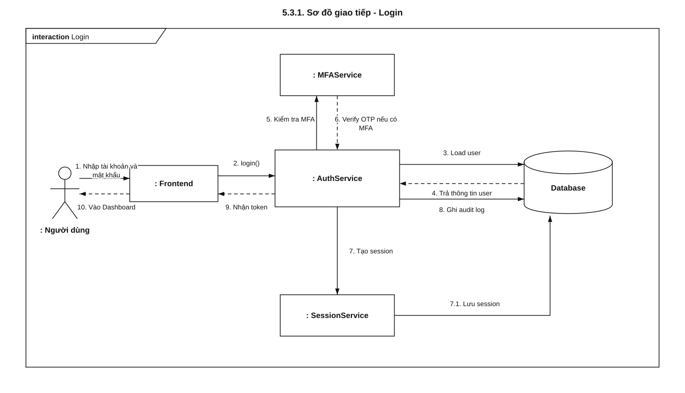

#### 5.3.2 Sơ đồ giao tiếp cho hoạt động: Logout

Nguồn hình SVG: [communication_auth_logout_staruml.svg](communication_auth_logout_staruml.svg)

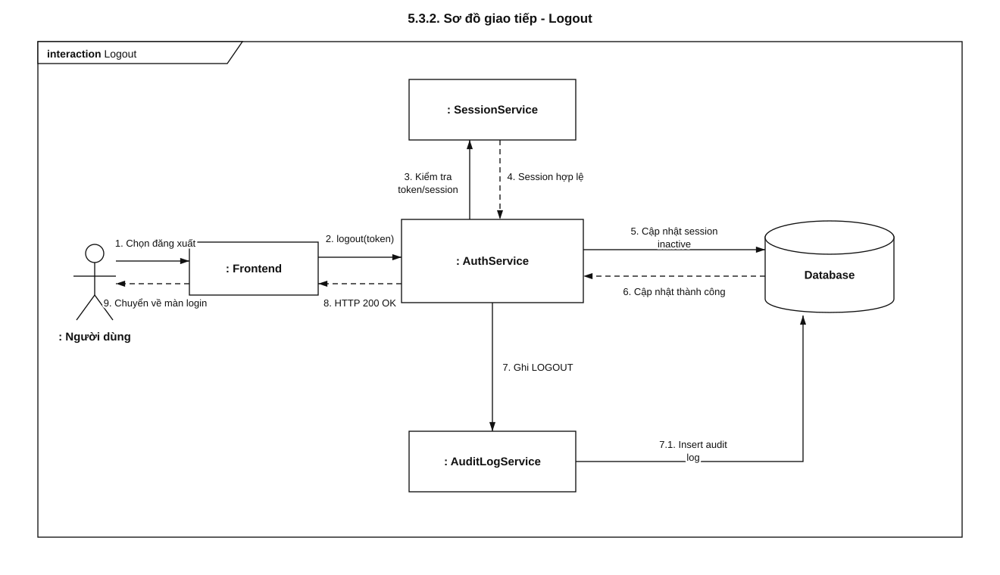

#### 5.3.3 Sơ đồ giao tiếp cho hoạt động: Admin lock account

Nguồn hình SVG: [communication_admin_lock_account_staruml.svg](communication_admin_lock_account_staruml.svg)

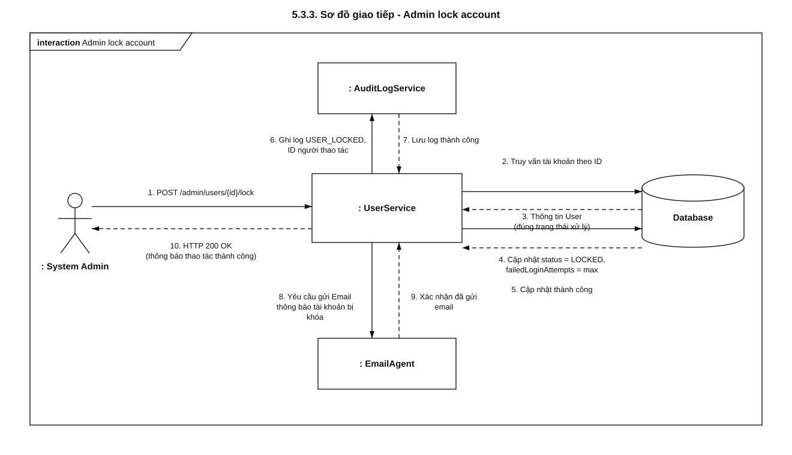

#### 5.3.4 Sơ đồ giao tiếp cho hoạt động: Admin unlock account

Nguồn hình SVG: [communication_admin_unlock_account_staruml.svg](communication_admin_unlock_account_staruml.svg)

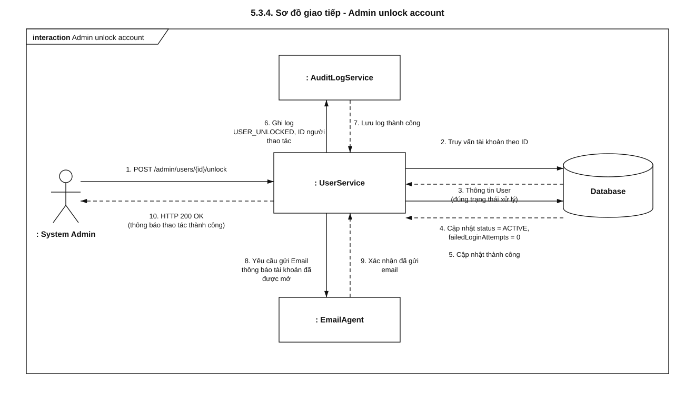

#### 5.3.5 Sơ đồ giao tiếp cho hoạt động: Admin manage Session

Nguồn hình SVG: [communication_admin_manage_session_staruml.svg](communication_admin_manage_session_staruml.svg)

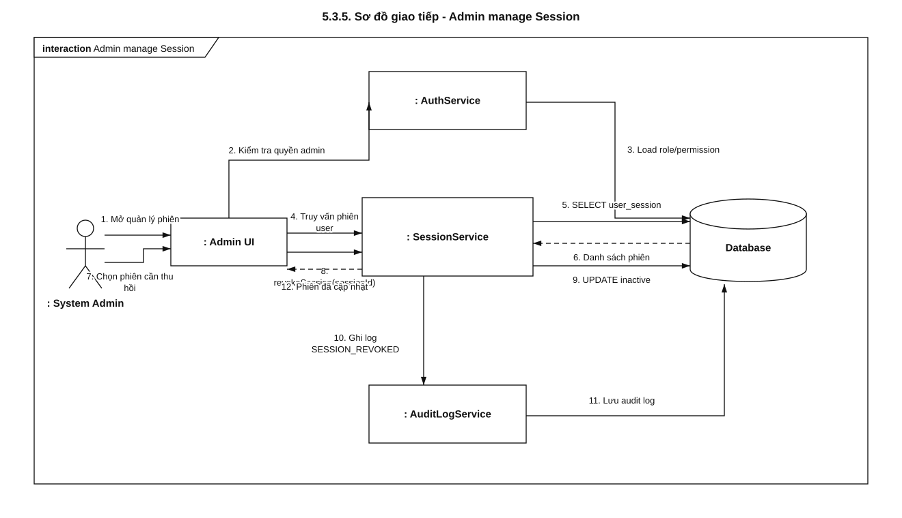

#### 5.3.6 Sơ đồ giao tiếp cho hoạt động: Admin config policy

Nguồn hình SVG: [communication_admin_config_policy_staruml.svg](communication_admin_config_policy_staruml.svg)

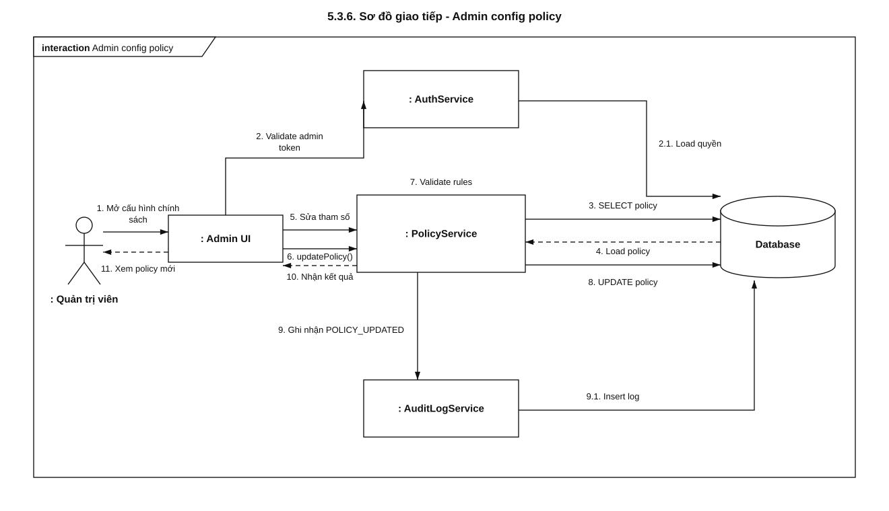

#### 5.3.7 Sơ đồ giao tiếp cho hoạt động: Enable MFA

Nguồn hình SVG: [communication_mfa_enable_staruml.svg](communication_mfa_enable_staruml.svg)

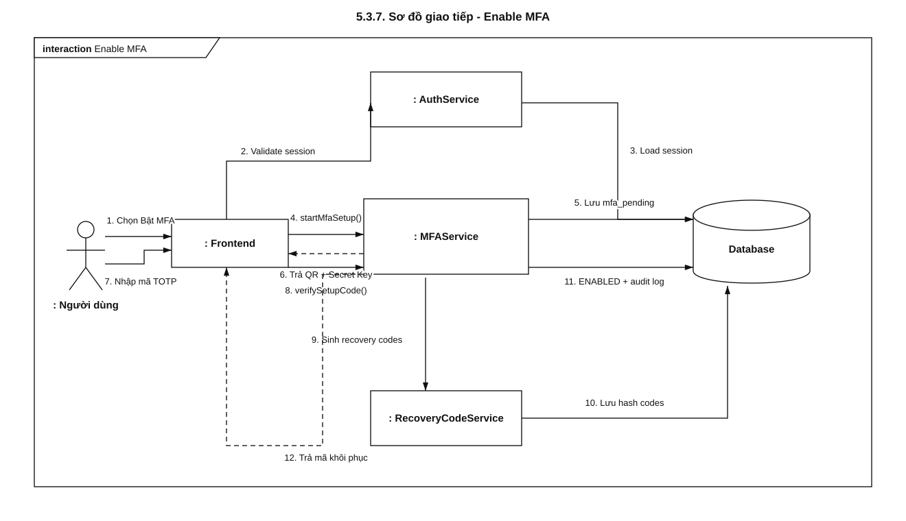

#### 5.3.8 Sơ đồ giao tiếp cho hoạt động: Disable MFA

Nguồn hình SVG: [communication_mfa_disable_staruml.svg](communication_mfa_disable_staruml.svg)

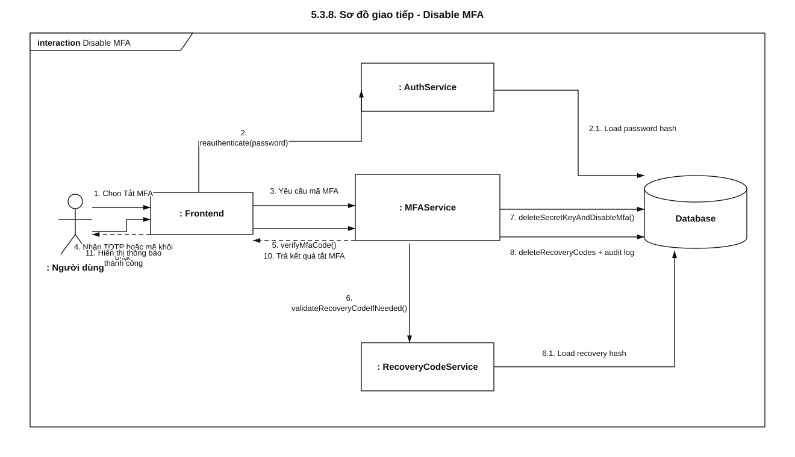

#### 5.3.9 Sơ đồ giao tiếp cho hoạt động: Change_password

Nguồn hình SVG: [communication_auth_change_password_staruml.svg](communication_auth_change_password_staruml.svg)

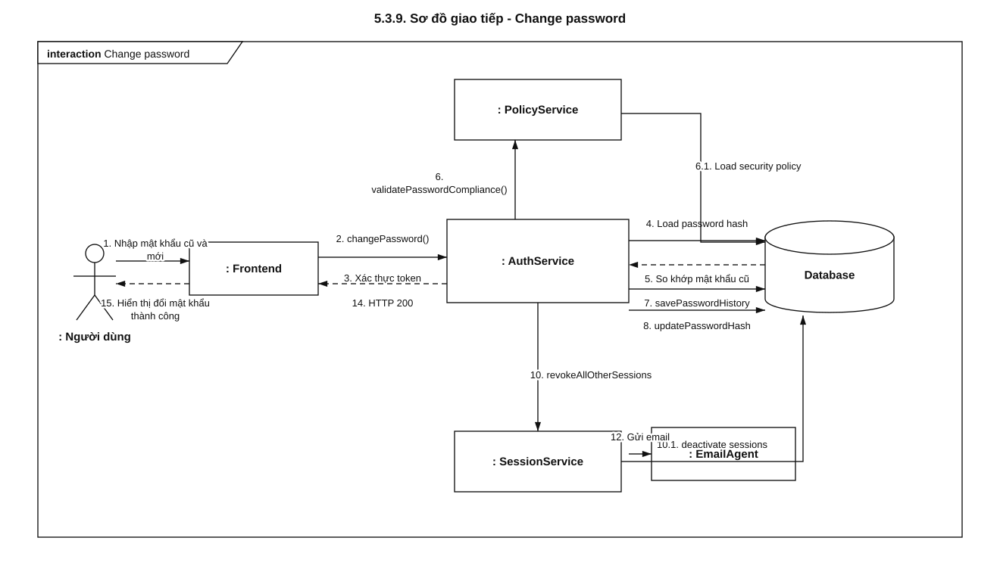

#### 5.3.10 Sơ đồ giao tiếp cho hoạt động: ClientApp gọi API

Nguồn hình SVG: [communication_client_app_call_api_staruml.svg](communication_client_app_call_api_staruml.svg)

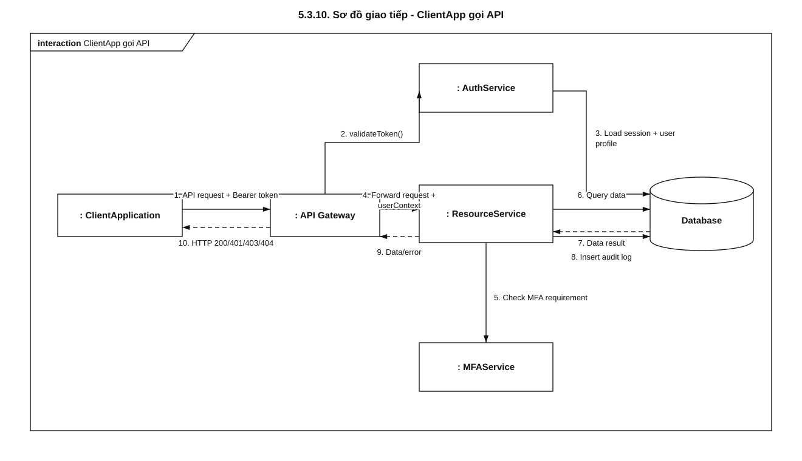


